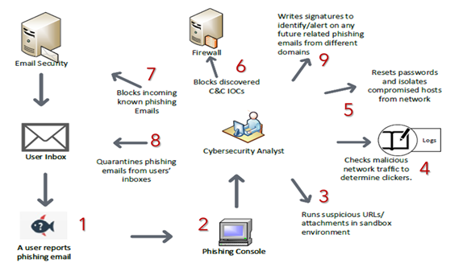

# INTRODUCTION

My problem domain will be on email phishing mitigation through phishing response. Because email systems are essential in business communications in providing efficient and effective means to transfer different types of electronic data, threat actors utilize email phishing attacks (type of social engineering attacks) to try and trick users to submit credentials or open malicious URLs or attachments to eventually gain a foothold in a target network as a part of a larger attack. Email phishing attacks are very common in the real world because human element is the weakest link in security; also, phishing tools are inexpensive and widespread. Nowadays, it is easy to craft sophisticated phishing emails that would deceive many users and eventually lead to credential theft or compromised hosts.

Phishing prevention and detection techniques can be very helpful in mitigating against email phishing attacks; however, response is very important as we will still have phishing attempts passing without detection.

My approach is focused on having an outlined phishing response Procedure to be followed in order to stop phishing attacks early in the killchain before maintaining persistence on the compromised hosts through the following:

-   Identification
-   Containment
-   Remediation
-   Root-cause analysis
-   Signature tuning and awareness training

# HYPOTHESIS & EMPIRICAL EVIDENCE

This email phishing response plan will decrease email threats and quickly recover from successful phishing campaigns early in the kill chain before maintaining persistence on the compromised hosts. Figure 1 shows a step by step process as the following:

1.  A user suspects a phishing email and reports it
2.  Cyber security analyst gets the email report in the phishing console
3.  Cyber security analyst runs any suspicious URLs/attachments in a sandbox environment
4.  Once determined malicious, cyber security analyst checks malicious network traffic to determine any clickers if it was a credential theft or system compromised reaching out to command and control
5.  Cyber security analyst initiates the process of resetting passwords and isolating compromised hosts from the network accordingly
6.  Cyber security analyst initiates the process of blocking discovered command and control IOCs at the Firewall level
7.  Cyber security analyst initiates the process of blocking incoming known phishing Emails
8.  Cyber security analyst quarantines known phishing emails from users’ inboxes
9.  Finally, Cyber security analyst writes signatures to identify/alert on any future related phishing emails at the TTP level (Tactics, Techniques, and Procedures)

## Figure 1 - Phishing Response Procedure

